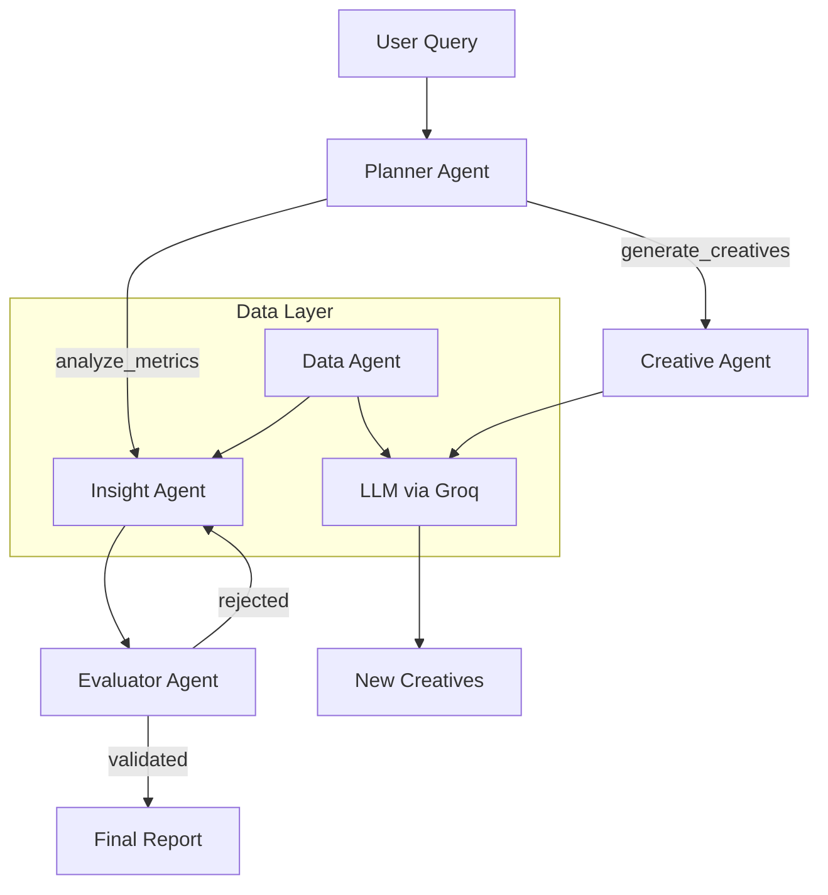

# Kasparro — Agentic Facebook Performance Analyst

An autonomous, multi-agent AI system that acts as a full-stack marketing analyst.
It plans tasks, cleans messy data automatically, diagnoses performance drops,
and generates creative solutions using **Llama 3 (via Groq)**.

---

## 🏗 Architecture

This system avoids linear scripting by implementing a **Planner–Evaluator**
architecture with a self-healing data layer.

> **Why this works:**  
> - No parentheses in node IDs  
> - No special characters inside edge labels  
> - Each edge is on its own line  
> - Fully GitHub‑Mermaid compliant



---

## 🤖 Key Agents

1. **Planner Agent**  
   Breaks down user intent into actionable subtasks.

2. **Data Agent**  
   Self-healing pipeline using LLM-assisted normalization and aggregation.

3. **Insight Agent**  
   Hypothesis-driven analysis of ROAS trends.

4. **Evaluator Agent**  
   Quantitative critic assigning confidence scores (0–1).

5. **Creative Agent**  
   Generates high-performing ad rewrites using direct-response principles.

---

## 🚀 Quick Start

### Prerequisites
- Python ≥ 3.10  
- Groq API key (https://console.groq.com)

### Installation
```bash
chmod +x run.sh
./run.sh "Why is ROAS dropping?"
```

---

## 🧪 Testing
```bash
python -m unittest tests/test_evaluator.py
```

---

**Architecture v1.0 implemented by Sunil Kumar**
